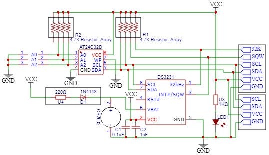

# I2C
# Port pins
| I2C | SCL | SDA  | PORT |
| ---- | ---- | ----- | ----- |
| 1 | X |  | PA13 |
| 1 | X |  | PA15 |
| 1 | X |  | PB8 |
| 1 |  | X | PA14 |
| 1 |  | X | PB7 |
| 2 | X |  | PA9 |
| 2 | X |  | PC4 |
| 2 | O |  | *PF6* |
| 2 |  | X | PA8 |
| 2 |  | x | PF0 |
| 3 | X |  | PA8 |
| 3 | O |  | *PC8* |
| 3 | O |  | *PF3* |
| 3 | O |  | *PG7* |
| 3 |  | X | PA9 |
| 3 |  | X | PB7 |
| 3 |  | O | *PPC9* |
| 3 |  | X | PC11 |
| 3 |  | O | *PF4* |
| 3 |  | O | *PG8* |
| 4 | X |  | PA13 |
| 4 | x |  | PC6 |
| 4 | O |  | *PF14* |
| 4 | O |  | *PG3* |
| 4 |  | X | PB7 |
| 4 |  | O | *PC7* |
| 4 |  | O | *PF15* |
| 4 |  | O | *PG4* |

## DS3231
