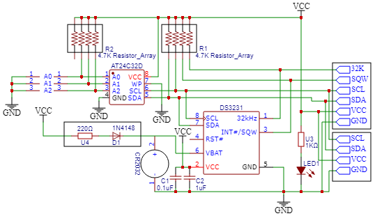

# Real Time Clock
The real time clock start up and read.
## STM32G474
### RTC 0x40002800
## Clock enables
```
  RCC->BDCR |= (RCC_BDCR_RTCSEL_0 | RCC_BDCR_RTCEN | RCC_BDCR_LSEON); // LSE
```

## Enable
```
  PWR->CR1 |= PWR_CR1_DBP;  // enable writing to RTC
  RTC->WPR = 0xCA;          // unlock
  RTC->WPR = 0x53;          // unlock
  RTC->ICSR |= RTC_ICSR_INIT;
  while((RTC->ICSR & RTC_ICSR_INITF) == 0);
  RTC->PRER = 0x7F << 16; 
  RTC->PRER |= 0xFF << 0;
  RTC->ICSR &= ~RTC_ICSR_INIT;
```

RTC needs to be writable and then unlocked.

## Read value
```
  uint32_t myDate, myTime;
  myTime = RTC->TR;
  myDate = RTC->DR;
  int year = 2000 + (((myDate>>20)&0xf)*10) + ((myDate >> 16)&0xf);
  int month = (((myDate>>12)&1)*10) + ((myDate>>8)&0xf);
  int day = (((myDate>>4)&3)*10) + (myDate & 0xf);
  int hour = (((myTime>>20)&7)*10) + ((myTime >> 16) & 0xf);
  int minute = (((myTime>>12)&0xf)*10) + ((myTime >> 8) & 0xf);
  int second = (((myTime>>4)&0xf)*10) + ((myTime >> 0) & 0xf);
```
## Set time and date
```
    RTC->TR = hd << 20 | hu << 16 | md << 12 | mu << 8 | sd << 4 | su << 0; // Set time
    RTC->DR = yd << 20 | yu <<1 6 | dow << 13 | md << 12 | mu << 8 | dd << 4 | du << 0;   // Set date
```

2024-12-30 MON 1:23:45

| Variable | Value |
| --- | ----------- |
| yd | 2 |
| yu | 4 |
| md | 1 |
| mu | 2 |
| dd | 3 |
| du | 0 |
| dow | **Mon = 1**, SUN = 7
| hd | 0 |
| hu | 1 |
| md | 1 |
| mu | 3 |
| sd | 4 |
| su | 5 |

## Board

