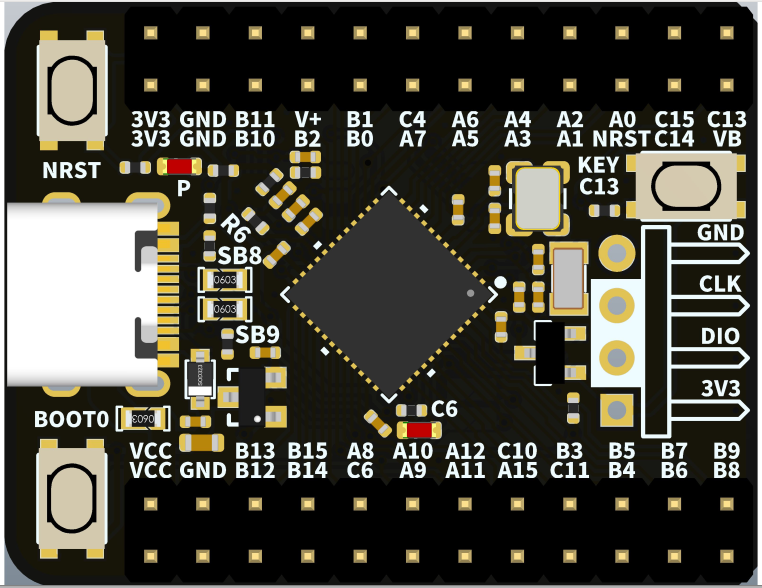
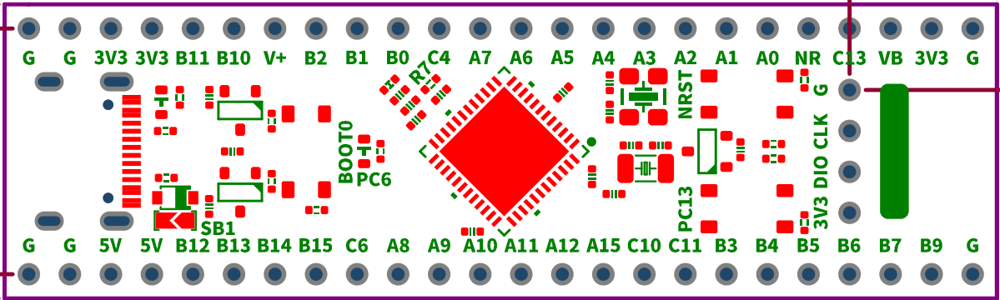

# Dales_tb
## ST code change by adding these two lines.
    ./USB_Device/App/usbd_cdc_if.c:262:void Menu(uint8_t* Buf, uint32_t Len);
    ./USB_Device/App/usbd_cdc_if.c:268:  Menu(Buf,*Len);  // DAS added

# Port pins
## As configured
| Port | Pin  | Long | Named | Special | Active | Voltage | HRTIM1 |
| ---- | ---- | ----- | ----- | ------- | ------ | ------- | ------- |
| PA0 | P2:20 | P2:6 |  |  | Input | 3.6 ||
| PA1 | P2:17 | P2:7 |  |  |  | 3.6 ||
| PA2 | P2:18 | P2:8 |  |  | LPUART1_TX | 3.6 ||
| PA3 | P2:15 | P2:9 |  |  | LPUART1_RX | 3.6 ||
| PA4 | P2:16 | P2:10 |  |  | DAC1_OUT1 | 3.6 ||
| PA5 | P2:13 | P2:11 |  |  | *DAC1_OUT2* | 3.6 ||
| PA6 | P2:14 | P2:12 |  | IO3 | DAC2_OUT1 | 3.6 ||
| PA7 | P2:11 | P2:13 |  | IO2 | | 3.6 ||
| **PA8** | P1:10 | P1:15 |  |  | TIM1_CH1 | 5.0 ||
| **PA9** | P1:11 | P1:14 |  |  | TIM1_CH2 | 5.0 ||
| PA10 | P1:12 | P1:13 |  |  | TIM1_CH3 | 5.0 ||
| PA11 | P1:13 |  |  | **USB_DN** |  | 5.0 ||
| PA12 | P1:14 |  |  | **USB_DP** |  | 5.0 ||
| **PA13** | P3:2 | P5:3 |  | SWDIO | I2C1_SCL | 5.0 ||
| **PA14** | P3:3 | P5:2 |  | SWCLK | I2C1_SDA | 5.0 ||
| **PA15** | P1:15 | P1:10 |  |  | SPI1_NSS | 5.0 ||
| PB0 | P1:13 | P2:15 |  | IO1 | | 3.6 ||
| PB1 | P2:10 | P2:16 |  | IO0 | | 3.6 ||
| PB2 | P2:7 | P2:17 |  | RTC_OUT2 | ADC2_IN12 | 3.6 ||
| PB3 | P1:18 | P1:7 |  |  | SPI1_SCK | 5.0 | eev 9 |
| PB4 | P1:19 | P1:6 |  |  | SPI1_MISO | 5.0 | eev 7 |
| PB5 | P1:20 | P1:5 |  |  | SPI1_MOSI | 5.0 | eev 6 |
| PB6 | P1:21 | P1:4 |  |  | TIM4_CH1 | 5.0 | eev 4|
| **PB7** | P1:22 | P1:3 |  |  | USART1_RX | 5.0 | eev 3 |
| **PB8** | P1:23 |  | BOOT0 | **BOOT0** | Input |  5.0 | eev 8 |
| PB9 | P1:24 | P1:2 | TEST_ |  | Output | 5.0 | eev 5 |
| PB10 | P2:5 | P2:19 |  | CLK | USART3_RX | 3.6 ||
| PB11 | P2:4 | P2:20 |  | nCS | USART3_TX | 3.6 ||
| PB12 | P1:5 | P1:20 | I2C_test |  |  | 3.6 ||
| PB13 | P1:6 | P1:19 |  |  | COMP5 | 3.6 ||
| PB14 | P1:7 | P1:18 |  |  | ADC4_IN4 | 3.6 ||
| PB15 | P1:8 | P1:17 | C_RESET |  | Input | 3.6 ||
| **PC4** | P2:12 | P2:14 |  |  | UART1_TX | 5.0 ||
| **PC6** | P1:9 | P1:16 | LED_Pin | **LED_Pin** | Output | 3.6 | eev 10 |
| PC10 | P1:16 | P1:9 |  |  | Output | 5.0 |
| **PC11** | P1:16 | P1:8 |  |  | Output | 5.0 | eev 2 |
| PC13 | P2:24 | P2:4 | KEY_Pin | **KEY_Pin** | Input | 5.0 ||
| PC14 | P2:21 |  |  | **OSC32_IN** | OSC32_IN| 5.0 ||
| PC15 | P2:22 |  |  | **OSC32_OUT** | OSC32_OUT | 5.0 ||
| **PF0** |  | | | **OSC_IN** | OSC_IN | 5.0 ||
| PF1 |  | | | **OSC_OUT** | OSC_OUT | 5.0 ||
| PG10 | P2:19 | P2:5| | **NRST** | NRST | 3.6 ||
| 3.3V | P1:1 |  |  | 3.3V | Power | 3.3V ||
| 3.3V | P1:2 |  |  | 3.3V | Power | 3.3V ||
| 5.0V | P2:1 |  |  | 5.0V | Power | 5.0V ||
| 5.0V | P2:2 |  |  | 5.0V | Power | 5.0V ||
| GND | P1:3 |  |  | GND | Power | GND ||
| GND | P1:4 |  |  | GND | Power | GND ||
| GND | P2:3 |  |  | GND | Power | GND ||
| GND | P2:4 |  |  | GND | Power | GND ||
| VB | P2:23 | P2:3 |  | VB | Power | 3.6V ||

## Debug
| Line | Color | Pin | Port | Signal |
| ---- | ----- | --- | ---- | ------ |
| GND | White | P2:4 | | GND |
| 0 | Black | P2:6 | PB11 | nCS |
| 1 | Brown | P2:5 | PB10 | CLK |
| 2 | RED | P2:10 | PB1 | IO0 |
| 3 | Orange | P2:9 | PB0 | IO1 |
| 4 | Yellow | P2:11 | PA7 | IO2 |
| 5 | Green | P2:14 | PA6 | IO3 |
| 6 | Blue | P2:12 | PC4 | USART1_TX |
| 7 | Purple | P2:16 | PA4 |  |
| GND | White | P2:4 | | GND |

## Pinout
| Name | Pin | Pin | Name | USB | Name | Pin | Pin | Name |
| ---- | --- | --- | ---- | --- | ---- | --- | --- | ---- |
| Vcc | 1 | 2 | Vcc |  | 3V3 | 1 | 2 | 3V3 |
| GND | 3 | 4 | GND |  | GND | 3 | 4 | GND |
| PB12 | 5 | 6 | PB13 |  | PB10 | 5 | 6 | PB11 |
| PB14 | 7 | 8 | PB15 |  | PB2 | 7 | 8 | V+ |
| PC6 | 9 | 10 | PA8 |  | PB0 | 9 | 10 | PB1 |
| PA9 | 11 | 12 | PA10 |  | PA7 | 11 | 12 | PC4 |
| PA11 | 13 | 14 | PA12 |  | PA5 | 13 | 14 | PA6 |
| PA15 | 15 | 16 | PC10 |  | PA3 | 15 | 16 | PA4 |
| PC11 | 17 | 18 | PB3 |  | PA1 | 17 | 18 | PA2 |
| PB4 | 19 | 20 | PB5 |  | PG10 | 19 | 20 | PA0 |
| PB6 | 21 | 22 |PB7  |  | PC14 | 21 | 22 | PC15 |
| PB8 | 23 | 24 | PB9 |  | Vb | 23 | 24 | PC13 |
|  | 1 |  | 2 |  | 3 |  | 4 |  |
|  | 3V3 |  | SWDIO |  | SWCLK |  | GND |  |

## Pinout-Long
| Name | Pin | USB | Pin | Name |
| ---- | --- | --- | --- | ---- |
| GND | 1 |  | 1 | GND |
| GND | 2 |  | 2 | GND |
| 5V0 | 3 |  | 3 | 3V3 |
| 5V0 | 4 |  | 4 | 3V3 |
| PB12 | 20 |  | 20 | PB11 |
| PB13 | 19 |  | 19 | PB10 |
| PB14 | 18 |  | 18 | V+ |
| PB15 | 17 |  | 17 | PB2 |
| PC6 | 16 |  | 16 | PB1 |
| PA8 | 15 |  | 15 | PB0 |
| PA9 | 14 |  | 14 | PC4 |
| PA10 | 13 |  | 13 | PA7 |
| PA11 | 12 |  | 12 | PA6 |
| PA12 | 11 |  | 11 | PA5 |
| PA15 | 10 |  | 10 | PA4 |
| PC10 | 9 |  | 9 | PA3 |
| PC11 | 8 |  | 8 | PA2 |
| PB3 | 7 |  | 7 | PA1 |
| PB4 | 6 |  | 6 | PA0 |
| PB5 | 5 |  | 5 | PG10 |
| PB6 | 4 |  | 4 | PC13 |
| PB7 | 3 |  | 3 | VB |
| PB9 | 2 |  | 2 | 3V3 |
| GND | 1 |  | 1 | GND |
|  | 1 | 2 | 3 | 4 |
|  | 3V3 | SWDIO | SWCLK | GND |

## Board

## DMA
| DMA | CHANNEL | MUX | USE |
| ---- |---- |---- |---- |
| 1 | 1 | 0 | LPUART1_Tx |
| 1 | 2 | 1 | USART1_Tx |
| 1 | 3 | 2 | USART3_Tx |
| 1 | 4 | 3 |  |
| 1 | 5 | 4 |  |
| 1 | 6 | 5 |  |
| 1 | 7 | 6 |  |
| 1 | 8 | 7 |  |
| 2 | 1 | 8 | SP1_Tx |
| 2 | 2 | 9 | SP1_Rx |
| 2 | 3 | 10 |  |
| 2 | 4 | 11 |  |
| 2 | 5 | 12 |  |
| 2 | 6 | 13 |  |
| 2 | 7 | 14 |  |
| 2 | 8 | 15 |  |

## Alternate
| Port | Alternate |
| ---- |---- |
| PA0 | 
TIM2_CH1 TIM5_CH1 USART2_CTS COMP1_OUT 
 TIM8_BKIN TIM8_ETR TIM2_ETR |
| PA1 | 
RTC_REFIN TIM2_CH2 TIM5_CH2
 
 USART2_RTS_DE TIM15_CH1N |
| PA2 | 
TIM2_CH3 TIM5_CH3 USART2_TX COMP2_OUT 
 TIM15_CH1 QUADSPI1_BK1_NCS LPUART1_TX UCPD1_FRSTX |
| PA3 | 
TIM2_CH4 TIM5_CH4 SAI1_CK1 USART2_RX 
 TIM15_CH2 QUADSPI1_CLK LPUART1_RX SAI1_MCLK_A |
| PA4 | 
TIM3_CH2 SPI1_NSS SPI3_NSS I2S3_WS USART2_CK SAI1_FS_B
 |
| PA5 | 
TIM2_CH1 TIM2_ETR SPI1_SCK  UCPD1_FRSTX
 |
| PA6 | 
TIM16_CH1 TIM3_CH1 TIM8_BKIN SPI1_MISO IM1_BKIN 
 COMP1_OUT **QUADSPI1_BK1_IO3** LPUART1_CTS |
| PA7 | 
TIM17_CH1 TIM3_CH2 TIM8_CH1N SPI1_MOSI TIM1_CH1N 
 COMP2_OUT **QUADSPI1_BK1_IO2** UCPD1_FRSTX |
| PA8 | 
MCO I2C3_SCL I2C2_SDA I2S2_MCK TIM1_CH1 USART1_CK 
 COMP7_OUT TIM4_ETR FDCAN3_RX SAI1_CK2 HRTIM1_CHA1 SAI1_SCK_A |
| PA9 | 
I2C3_SMBA I2C2_SCL I2S3_MCK TIM1_CH2 USART1_TX OMP5_OUT 
 TIM15_BKIN TIM2_CH3 HRTIM1_CHA2 SAI1_FS_A |
| PA10 | 
TIM17_BKIN USB_CRS_SYNC I2C2_SMBA SPI2_MISO TIM1_CH3 
 USART1_RX COMP6_OUT TIM2_CH4 TIM8_BKIN SAI1_D1 HRTIM1_CHB1 SAI1_SD_A |
| PA11 | 
SPI2_MOSI I2S2_SD TIM1_CH1N USART1_CTS COMP1_OUT 
 FDCAN1_RX TIM4_CH1 TIM1_CH4 TIM1_BKIN2 HRTIM1_CHB2 |
| PA12 | 
TIM16_CH1, I2SCKIN TIM1_CH2N USART1_RTS_DE COMP2_OUT 
 FDCAN1_TX TIM4_CH2 TIM1_ETR HRTIM1_FLT1 |
| PA13 | 
**SWDIO-JTMS** TIM16_CH1N I2C4_SCL, I2C1_SCL IR_OUT 
 USART3_CTS TIM4_CH3 SAI1_SD_B|
| PA14 | 
**SWCLK-JTCK** LPTIM1_OUT I2C4_SMBA I2C1_SDA TIM8_CH2 
 TIM1_BKIN USART2_TX SAI1_FS_B |
| PA15 | 
JTDI TIM2_CH1 TIM8_CH1 I2C1_SCL SPI1_NSS SPI3_NSS 
 I2S3_WS USART2_RX UART4_RTS_DE TIM1_BKIN FDCAN3_TX HRTIM1_FLT2 TIM2_ETR |
| PB0 | TIM3_CH3 TIM8_CH2N TIM1_CH2N **QUADSPI1_BK1_IO1** HRTIM1_FLT5 UCPD1_FRSTX         |
| PB1 | 
TIM3_CH4 TIM8_CH3N TIM1_CH3N COMP4_OUT **QUADSPI1_BK1_IO0** 
 LPUART1_RTS_DE HRTIM1_SCOUT EVENTOUT|
| PB2 | **RTC_OUT2** LPTIM1_OUT TIM5_CH1 TIM20_CH1 I2C3_SMBA QUADSPI1_BK2_IO1 HRTIM1_SCIN |
| PB3 | 
JTDO-TRACESWO TIM2_CH2 TIM4_ETR UCPD1_CRS_SYNC TIM8_CH1N SPI1_SCK SPI3_SCK
 nI2S3_CK USART2_TX TIM3_ETR FDCAN3_RX HRTIM1_SCOUT HRTIM1_EEV9 SAI1_SCK_B |
| PB4 | 
JTRST, TIM16_CH1 TIM3_CH1 TIM8_CH2N SPI1_MISO SPI3_MISO 
 USART2_RX UART5_RTS_DE TIM17_BKIN FDCAN3_TX HRTIM1_EEV7 SAI1_MCLK_B |
| PB5 | 
TIM16_BKIN TIM3_CH2 TIM8_CH3N I2C1_SMBA SPI1_MOSI SPI3_MOSI I2S3_SD USART2_CK
 I2C3_SDA FDCAN2_RX TIM17_CH1 LPTIM1_IN1 SAI1_SD_B HRTIM1_EEV6 UART5_CTS |
| PB6 | 
TIM16_CH1N TIM4_CH1 TIM8_CH1 TIM8_ETR USART1_TX COMP4_OUT 
 FDCAN2_TX TIM8_BKIN2 LPTIM1_ETR HRTIM1_SCIN HRTIM1_EEV4 SAI1_FS_B |
| PB7 | 
TIM17_CH1N TIM4_CH2 I2C4_SDA I2C1_SDA TIM8_BKIN USART1_RX 
 COMP3_OUT TIM3_CH4 LPTIM1_IN2 FMC_NL HRTIM1_EEV3  UART4_CTS |
| PB8 | 
TIM16_CH1 TIM4_CH3 SAI1_CK1 I2C1_SCL USART3_RX COMP1_OUT 
 FDCAN1_RX TIM8_CH2 TIM1_BKIN HRTIM1_EEV8 SAI1_MCLK_A |
| PB9 | 
TIM17_CH1 TIM4_CH4 SAI1_D2 I2C1_SDA IR_OUT USART3_TX 
 COMP2_OUT FDCAN1_TX TIM8_CH3 TIM1_CH3N HRTIM1_EEV5 SAI1_FS_A |
| PB10 | IM2_CH3 USART3_TX LPUART1_RX **QUADSPI1_CLK** TIM1_BKIN HRTIM1_FLT3 SAI1_SCK_A |
| PB11 | TIM2_CH4 USART3_RX LPUART1_TX **QUADSPI1_BK1_NCS** HRTIM1_FLT4 |
| PB12 | 
TIM5_ETR I2C2_SMBA SPI2_NSS I2S2_WS TIM1_BKIN 
 USART3_CK LPUART1_RTS_DE FDCAN2_RX HRTIM1_CHC1 |
| PB13 | 
SPI2_SCK/I2S2_CK TIM1_CH1N USART3_CTS LPUART1_CTS 
 FDCAN2_TX HRTIM1_CHC2 |
| PB14 | 
TIM15_CH1 SPI2_MISO TIM1_CH2N USART3_RTS_DE 
 COMP4_OUT HRTIM1_CHD1 |
| PB15 | 
RTC_REFIN TIM15_CH2 TIM15_CH1N COMP3_OUT TIM1_CH3N 
 SPI2_MOSI I2S2_SD HRTIM1_CHD2 |
| PC4 | TIM1_ETR I2C2_SCL USART1_TXQUADSPI1_BK2_IO3 |
| PC6 | 
TIM2_CH3 USART3_TX LPUART1_RX QUADSPI1_CLK TIM1_BKIN 
 HRTIM1_FLT3 SAI1_SCK_A EVENTOUT |
| PC11 | HRTIM1_EEV2 TIM8_CH2N UART4_RX SPI3_MISO USART3_RX I2C3_SDA                  |
| PC13 | TIM1_BKIN TIM1_CH1N TIM8_CH4N |
| PC14 |  |
| PC15 |  |
| PF0 | I2C2_SDA SPI2_NSS I2S2_WS TIM1_CH3N |
| PF1 | SPI2_SCK I2S2_CK |
| PG10 | MCO |

## Additional
| Port | 1 | 2 | 3 | 4 | 5 | 
| ---- |---- |---- |---- |---- |---- |
| PA0 | ADC12_IN1 | COMP1_INM  | COMP3_INP|
| PA1 | ADC12_IN2 | COMP1_INP  | OPAMP1_VINP | OPAMP3_VINP   | OPAMP6_VINM |
| PA2 | ADC1_IN3 | COMP2_INM  | OPAMP1_VOUT |
| PA3 | ADC1_IN4 | COMP2_INP  | OPAMP1_VINM | OPAMP1_VINP | OPAMP5_VINM|
| PA4 | ADC2_IN17 | DAC1_OUT1  | COMP1_INM  |
| PA5 | ADC2_IN13 | DAC1_OUT2  | COMP2_INM  | OPAMP2_VINM |
| PA6 | ADC2_IN3 | DAC2_OUT1  | OPAMP2_VOUT |
| PA7 | ADC2_IN4 | COMP2_INP  | OPAMP1_VINP | OPAMP2_VINP |
| PA8 | ADC5_IN1 | OPAMP5_VOUT |
| PA9 | ADC5_IN2 | UCPD1_DBCC1 |
| PA10 | UCPD1_DBCC2 | PVD_IN |
| PA11 | **USB_DM** |
| PA12 | **USB_DP** |
| PA13 |  |
| PA14 |  |
| PA15 |  |
| PB0 | ADC3_IN12 | ADC1_IN15 | COMP4_INP | OPAMP2_VINP | OPAMP3_VINP|
| PB1 | ADC3_IN1 | ADC1_IN12 | COMP1_INP | OPAMP3_VOUT| OPAMP6_VINM|
| PB2 | ADC2_IN12 | COMP4_INM | OPAMP3_VINM|
| PB3 |  |
| PB4 | UCPD1_CC2 |
| PB5 |  |
| PB6 | UCPD1_CC1 |
| PB7 |  |
| PB8 |  |
| PB9 |  | 
| PB10 | COMP5_INM | OPAMP3_VINM | OPAMP4_VINM |
| PB11 | ADC12_IN14 | COMP6_INP | OPAMP4_VINP  | OPAMP6_VOUT |
| PB12 | ADC4_IN3 | ADC1_IN11 | COMP7_INM | OPAMP4_VOUT| OPAMP6_VINP |
| PB13 | ADC3_IN5 | COMP5_INP | OPAMP3_VINP | OPAMP4_VINP| OPAMP6_VINP |
| PB14 | ADC4_IN4 | ADC1_IN5 | COMP7_INP | OPAMP2_VINP | OPAMP5_VINP |
| PB15 | ADC4_IN5 | ADC2_IN15  | COMP6_INM  | OPAMP5_VINM |
| PC4 | ADC2_IN5 |
| PC6 |  |
| PC11 |  |
| PC13 | WKUP2 | RTC_TAMP1 | RTC_TS | RTC_OUT1 |
| PC14 | **OSC32_IN** |
| PC15 | **OSC32_OUT** |
| PF0 | ADC1_IN10 | **OSC_IN**|
| PF1 | ADC2_IN10 | COMP3_INM  | **OSC_OUT** |
| PG10 | **NRST** |
